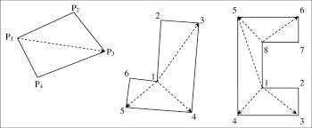

## Stubs to be implemented

### `Block::moment_of_inertia()`
I haven't looked into this enough to know *for certain* if it is actually possible to implement given our constraints, but as the name implies, this should return the moment of inertia of the block. This will involve using Calculus to, from what I can tell, integrate over point masses within the block. I would use `Block::get_triangulation()` to get those point masses, since it is easy to discern whether or not a point is within a triangle.

### `QuadtreeNode::are_colliding(Block* b1, Block* b2)`
Returns `true` if the two blocks are overlapping each-other (colliding), or `false` otherwise. This should involve two phases:
* Check for possible collision using `Block::bounding_box()`. If the bounding boxes of the shapes do not overlap, then they are not colliding.
* Lastly, call `Block::get_triangulation()` on both blocks, then iterate over all the triangles composing each block. If any of the triangles composing one block intersects a triangle composing the other block, then the blocks must be colliding.

### `QuadtreeNode::insert_block(Block*)`
Inserts a block into the quadtree, like so:
* If the block could fit into just one quadrant of this node:
    * If that quadrant already exists: insert the block into it
    * Otherwise, create the quadrant and insert the block into it
* Else if the number of blocks contained in this node is greater than the split threshold (`QuadtreeNode::split_threshold`), 

### `QuadtreeNode::remove_block(Block*)`
Remove the block from the quadtree. If no other blocks were stored in the node that stored the block, then delete that node.

### `CollisionGroup::find_collisions()`
Given two blocks, return all the collisions between the two, as in the image below.

### `Collision::calc_impulse(Point*)`

Use the following formula.

* $\hat{n}$ is the normalized collision normal vector, stored in the `normal` field of the `Collision` class.
* $m$ is the mass of the object the point is associated with.
* $I$ is the moment of inertia of the object the point is associated with.
* $v$ is the relative velocity vector between the two blocks.
* $\omega$ is the relative rotational velocity vector between the two blocks.
* $r$ is the vector that goes from the center of mass of the object the point is associated with to the point itself.
* $\theta$ is the angle between $r$ and $n$.
* $\lambda$ is the impulse (the return value).

$$
z = ||r||\sin\theta \rightarrow
\lambda = (\frac{\hat{n}_x^2+\hat{n}_y^2}{m} + \frac{z^2}{I})^{-1}(\hat{n}_xv_x+\hat{n}_yv_y\pm z\omega)
$$

## Completed (to be tested)

### `Block::bounding_box()`
Returns an (unrotated) rectangle which perfectly contains the block. Unlike `Block::center_of_mass()`, the rotation and position of the block must be taken into account.

### `Triangle::centroid()`
Returns the centroid of the triangle.

### `Block::get_triangulation()`
Don't implement this (I've already started on it). However, **you have to understand what this function does** because it makes implementing all the other functions much easier. This function returns a list of triangles which make up the triangle decomposition of the block, as in the image below. Triangulation **has already been implemented** as part of the drawing process, but minor modifications need to be made to get the results from that process out of this function.

### `Block::center_of_mass()`
Returns the location of the block's center of mass **relative to the first Point in the vertices field, assuming that the object's rotation is zero**. The easiest way to implement this is *probably* by using `Block::get_triangulation()` to get the list of triangles that make up the block, then calling `Triangle::centroid()` on each triangle (the centroid of a triangle is its center of mass) and using that information to calculate the center of mass of the block itself.

### `Vect2`
Comes with the following functions:
* `direction()`
* `magnitude()`
* (static) `dot_product(Vect2, Vect2)`
* operators for multiplication and division by scalar values
* operators for addition and subtraction of other `Vect2`'s

This is just a vector consisting of two doubles, which are usually going to be x and y coordinates, thus the `direction()` and `magnitude()` functions should return the direction and magnitude of the vector assuming that the vector's first value is an x coordinate and the vector's second value is a y coordinate.

For specifics:
* `direction` returns the angle between the vector and the +x axis, as if the vector was placed on the unit circle. Basically, it returns the theta seen in the image below. Make sure you use `normalize_angle`, defined in `Block.h`, on your output to ensure that it falls between 0 and 2*pi radians.
    
* `magnitude` returns the length of the vector.
